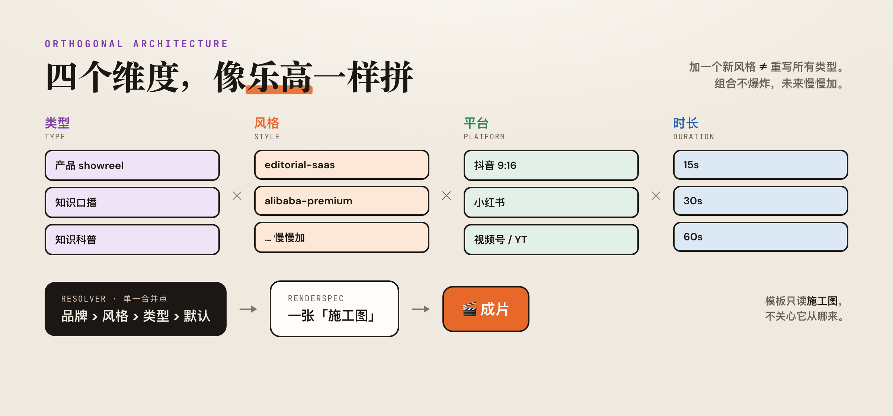
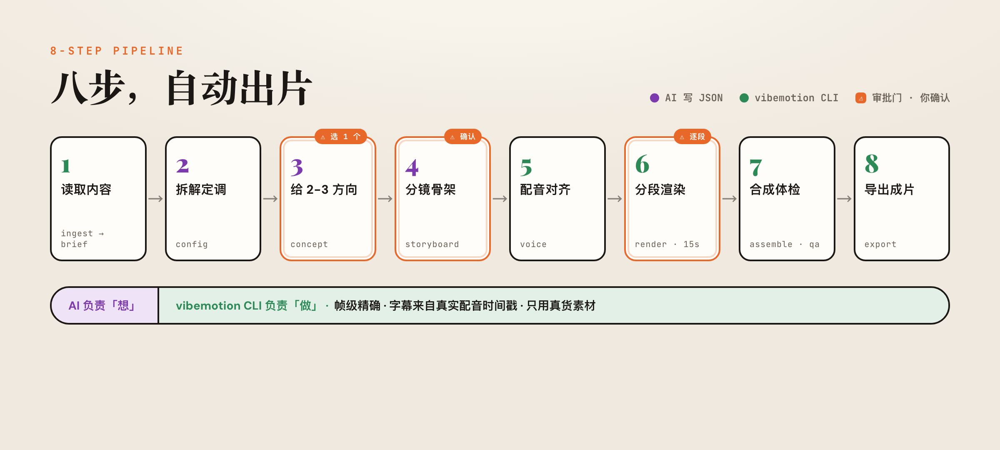

<div align="center">


# 🎬 vibe-motion-video

**把任意内容，自动做成「设计师级」视频的端到端流水线。**

读一个链接 / 一段视频 / 一个产品代码目录 / 一篇文章 / 一句话想法 →
自动跑通 **拆解定调 → 选方向 → 分镜 → 配音对齐 → 分段渲染 → 合成体检 → 导出成片**。

创意由 AI 写 JSON，机械活交给 `vibemotion` CLI（Remotion 渲染）。

[](./LICENSE)
[](https://remotion.dev)
[](https://nodejs.org)
[](#怎么用)

</div>

---

## 这是什么

`vibe-motion-video` 是一个 **AI Agent skill**（给 Claude Code / Codex 用），把"做视频"这件事拆成两半：

| 创意活（AI 来写，换谁都一样） | 机械活（CLI 来干，确定性） |
|---|---|
| 读素材、理解重点、写分镜 JSON、选音色、判断好不好看 | 抓取/转写、TTS + 字幕对齐、渲染、ffmpeg 合成、校验、导出 |

两边用一份 **渲染器无关的 JSON 中间表示（IR）** 做合约。于是：AI 负责"想"，代码负责"做"，**一次比一次好看，而且可复用、可批量、可回滚**。

能产出的视频类型：**产品 showreel、产品介绍、知识科普、知识博主口播**……（类型可扩展）。

> 一句话：**用 AI 写脚本、用代码（Remotion）渲染视频。审美你把关，剩下的它全包。**

---

## 能解决什么

做视频的人都懂这几种痛——这个 skill 就是冲着它们设计的：

| 痛点 | 传统做法 | 这个 skill 怎么解 |
|---|---|---|
| **慢、贵** | 一条 showreel 剪到深夜 | AI 写分镜 JSON，代码批量渲染，改一版只重渲那一段 |
| **改稿地狱** | 改个文案/时长，整条重剪 | 分镜是结构化数据，改 JSON → 只重渲受影响的 15s 分段 |
| **模板一眼假** | 套通用模板，俗气渐变 + emoji 图标 | 反 slop 清单 + 真实色板 + 拆解好片沉淀的"风格包" |
| **AI 视频很"slop"** | 提示词糊一段，糊出一坨 | 分镜帧级精确、字幕来自真实配音时间戳、绝不编造占位素材 |
| **要适配各种需求** | 抖音/小红书/视频号各做一套 | 平台/风格/时长是**正交维度**，像乐高拼，不爆炸 |
| **不可复现** | 这次的效果，下次复刻不出来 | 每个素材带 seed/prompt，`manifest.json` 全程可追溯 |

对设计师尤其友好：**不用啃 After Effects**，用你本来就有的审美 + 一套提示词就能出片。AI 先扛 80 分，最后 20 分的品味交给你。

---

## 为什么这么设计

几条贯穿全局的设计哲学（也是这个 repo 最值得抄的部分）：

- **🧩 创意 / 机械分离。** AI 只写 JSON（brief / concepts / storyboard），所有不确定性都隔离在"创意"侧；CLI 干一切机械活，确定、可重试、可断点续跑。
- **📐 正交维度，不是组合爆炸。** `类型 × 风格 × 平台 × 时长` 四个维度独立组合，像乐高。加一个新风格 ≠ 重写所有类型。真正的耦合只有两处（密度拟合、响应式布局），用函数处理而不是查表。
- **🎯 单一合并点 Resolver → RenderSpec。** 所有维度在一个地方按优先级（品牌 > 风格 > 类型 > 默认）合并成一张"施工图"，模板只读这张图，不关心它从哪来。今天是 Remotion，未来换渲染后端也不用动模板。
- **📚 三层知识。** Layer 0 动效宪法（通用物理/节奏）· Layer 1 类型 playbook（showreel 怎么编排）· Layer 2 风格包组件（"好看"活在这一层）。
- **🔁 拆解 → 沉淀闭环。** 看到喜欢的好片 → `vibemotion teardown` 拆解 → 把规律填进风格包 → 产出质量上升。**架构不变，质量随拆解增长。**

<div align="center"></div>

---

## 八步流水线

<div align="center"></div>

| 步 | 干什么 | 谁来做 |
|---|---|---|
| ① **ingest** | 读链接/视频/代码/文章/想法 → 结构化原料 → `brief.json`（视频先抓现成字幕，省 token，不把视频喂模型） | CLI 抓取 + AI 提炼 |
| ② **config** | 定类型/平台/风格/时长/是否配音字幕 → `config.json` | AI |
| ③ **concept** ⚠️ | 出 2-3 个不同钩子的方向，**停下让你选 1 个** | AI + 你 |
| ④ **storyboard** ⚠️ | 帧级精确的分镜表（每镜时长/画面/台词），**停下让你确认** | AI + 你 |
| ④· **assets** | 若分镜需要真实素材（logo/截图/产品图），列出缺口清单让你补。**只用真货，不编占位** | CLI 扫描 + 你补 |
| ⑤ **voice** | 你给 TTS key → 合成配音 + 取词级时间戳 → 字幕 100% 对齐真实音频 | CLI |
| ⑥ **render** ⚠️ | 按 15s 分段渲染，**渲一段给你看一段**，OK 才渲下一段 | CLI + 你 |
| ⑦· **music** | showreel 出 BGM 提示词（投喂 Suno/Udio）+ 可选**卡点**（scene 边界吸到鼓点） | CLI + 你 |
| ⑦ **assemble + qa** | ffmpeg 拼接 + ducking + 响度归一 -14 LUFS + 字幕 → ffprobe 抽帧体检 | CLI |
| ⑧ **export** | 产出成片 mp4 + `.srt` + 音频 + `manifest.json`（可复现），可多比例导出 | CLI |

**三道审批门（③④⑥）必须等你确认**——审美由人把关，AI 不替你拍板。

---

## 怎么用

> 这是个 **Agent skill**，主要在对话里被自然语言触发，不需要你记命令。

**作为 Claude Code skill：**
```bash
# 放到 skills 目录（已在则跳过）
git clone https://github.com/chusimin/vibe-motion-video.git ~/.claude/skills/vibe-motion-video
cd ~/.claude/skills/vibe-motion-video && npm install
```
然后在 Claude Code 里直接说：
> "帮我把这个产品做成 showreel：<链接/目录>"
> "把这篇文章做成知识科普视频"

Agent 会自动按八步流水线推进，在三道审批门停下来等你。

**直接用 CLI（机械活）：**
```bash
node bin/vibemotion.mjs doctor          # 体检环境（node / ffmpeg / 可选 yt-dlp / whisper）
node bin/vibemotion.mjs init my-project # 起一个项目
node bin/vibemotion.mjs status          # 看状态机走到哪
node bin/vibemotion.mjs --help          # 全部子命令
```

**依赖：** Node 18+、`ffmpeg`（合成必需）。可选：`yt-dlp`（抓视频字幕）、`whisper-cli`（本地转写/强制对齐）、TTS key（`MINIMAX_API_KEY` 或 `ELEVENLABS_API_KEY`，仅配音时需要）。

---

## 目录结构

```
vibe-motion-video/
├─ SKILL.md / AGENTS.md / PLAYBOOK.md   # 给 Agent 的入口 + 8 步编排 SOP
├─ bin/vibemotion.mjs                    # CLI 路由（ingest…export / music / teardown）
├─ schemas/                              # brief / config / storyboard 的 JSON 合约
├─ src/                                  # 各步模块 + lib（resolver / ffmpeg / project 状态机）
├─ remotion/src/templates/
│   ├─ _base/                            # 渲染器无关的基础模板（读 RenderSpec）
│   └─ styles/editorial-saas/           # 风格包组件（"好看"活在这层）
├─ presets/
│   ├─ platforms/  structures/  styles/  audio/   # 平台/结构/风格/BGM 预设
├─ docs/                                 # 架构 / 动效宪法 / showreel 工艺 / 贡献指南
└─ references/teardowns/                 # 拆解沉淀（含音频 BPM/卡点拆解）
```

详见 [`docs/architecture.md`](./docs/architecture.md)、[`PLAYBOOK.md`](./PLAYBOOK.md)。

---

## 怎么做出来的

这个 skill **不是一次写成的，而是和 Claude Code 结对、用"拆解 → 沉淀"的闭环一点点长出来的**。git 历史就是它的成长史：

1. **先搭确定性骨架** —— 目录/状态机/JSON Schema/CLI 路由，把"机械活"全部隔离成可测试、可回滚的命令。
2. **打通八步流水线** —— ingest → config → concept/storyboard → voice → render → assemble/qa → export，端到端先跑通一条 Banner Maker showreel。
3. **遇到真问题：做出来不好看。** 于是抽象出 **正交维度架构**（Resolver → RenderSpec），解决"加一个需求就组合爆炸"的恐惧。
4. **批量拆解喜欢的参考片** —— 把好片逐镜拆成数据（时长/运动/色板/文案密度），填进 **editorial-saas 风格包**，质量肉眼可见地起来。
5. **用户反馈"太慢"** —— 对照参考片的密集帧条，定下**快节奏规则**（1–1.5s/镜、巨字极简、持续放大缩小），写进动效宪法 + 升级组件。
6. **加音频** —— 拆解 7 条对标片的 BPM/鼓点/响度，沉淀成 BGM 提示词预设 + **卡点**（scene 边界吸到鼓点）。

> **方法论本身可复用：** 架构定死"创意/机械分离 + 正交维度 + 单一合并点"，质量则靠"拆解好片 → 填进风格包"持续注入。想让它更好看，不是改架构，而是喂更多拆解。

完整方法论另有一份配套课件（cream 编辑部风格 HTML），把这套"AI + Remotion 产出视频"的经验讲透。

---

## 怎么扩展

架构已经把"未来慢慢加"的口子留好了，详见 [`docs/contributing.md`](./docs/contributing.md)：

- **加新风格** → 在 `presets/styles/` + `remotion/src/templates/styles/<style>/` 放一套 tokens + 组件，走 `override || _base/fallback`。
- **加新类型** → 在 `presets/structures/` 写结构 + `docs/types/<type>.md` 写 playbook（有 `_TEMPLATE.md` 可抄）。
- **喂新拆解** → `vibemotion teardown <参考片>` 半自动拆解 → 把规律填进风格包；音频走音频 pass。

---

## 设计心法

> - **AI 给 80 分，最后 20 分的品味靠人。** 三道审批门就是把人放在该在的位置。
> - **先给图，少给指令。** 每段先渲出来给眼睛看，再迭代，比堆需求词管用。
> - **只用真货。** 真实色板、真实素材、真实配音时间戳——不编造占位，是"不 slop"的底线。

---

## License

[Apache-2.0](./LICENSE) © 2026 chusimin

> 用 [Claude Code](https://claude.com/claude-code) 结对搭建。
